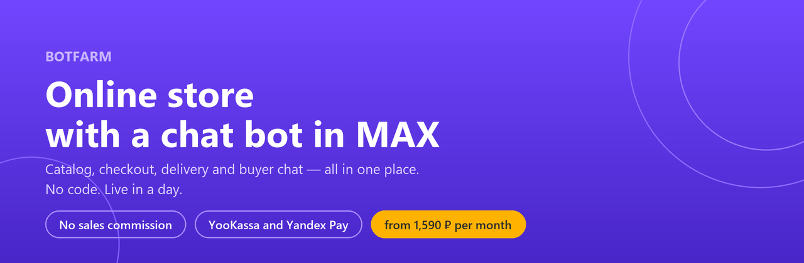
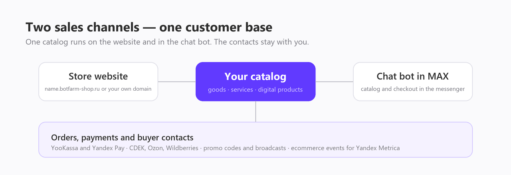

# 🛍️ BOTFARM — online store with a chat bot in MAX

[Русский](README.md) · **English**

🔗 Product site: **https://botfarm.online/shop/** · Updated: 1 September 2026

---

## 💡 What the BOTFARM store is

**BOTFARM is an online store builder that runs as a website and as a chat bot inside MAX, a Russian messenger, at the same time.** Catalog, cart, checkout and the conversation with the buyer sit in one place. No developer needed — a store goes live in a day. You can sell physical goods, services and digital products. The service charges a flat fee and takes no percentage of sales.

Built by FLEXIBASE LLC (INN 7733355085), in operation since 2020. The product targets the Russian market: prices are in rubles, payments run through YooKassa and Yandex Pay, analytics is wired to Yandex Metrica.

### 📌 Product at a glance

| Attribute | Value |
| --- | --- |
| What it is | online store builder with a chat bot in MAX |
| Who it's for | small business: retail, food service, services, digital goods |
| Price | 2,590 ₽ per month; 1,990 ₽ when paid for 6 months; 1,590 ₽ when paid for 12 months |
| Trial | 10 days for 1 ₽, once per account |
| Sales commission | none |
| Payments | YooKassa, Yandex Pay, cash or bank transfer on delivery |
| Delivery | pickup, courier, CDEK, Ozon and Wildberries pickup points |
| Analytics | ecommerce events for Yandex Metrica, microdata markup, product feeds |
| Time to launch | one day |
| Interface language | Russian |
| Market | Russia |

---

## 🎯 The problem it solves

A small seller usually picks between a marketplace and a website of their own. The marketplace takes a cut of every order and keeps the buyer's contacts. A website has to be built, maintained, filled with legal documents, and somehow supplied with traffic.

- 💸 **Revenue commission.** BOTFARM charges a flat fee for the store and takes no percentage of sales. The price does not grow with your customer base.
- 👤 **Someone else's customer base.** The name and phone number stay with you, so you can reach the buyer again through a broadcast or the chat bot.
- 🚚 **Delivery markup.** You pay the carrier directly at its own rates — BOTFARM adds no markup and takes no cut of the order.
- ⚡ **A long path to payment.** The buyer goes from catalog to checkout inside the messenger: no jump to a third-party site, no registration, no re-entering data.
- 📄 **A site without the mandatory legal pages.** The store ships with boilerplate forms: terms of use, personal data policy, cookie policy.
- 📣 **A single sales channel.** The bot link goes on business cards, banners, product packaging, social profiles — contacts land in one base.

---

## 🆚 BOTFARM vs a marketplace vs a custom-built site

| | BOTFARM | Marketplace | Custom-built site |
| --- | --- | --- | --- |
| Sales commission | none | yes, varies by platform and category | none |
| Buyer contacts | stay with the seller | stay with the platform | stay with the seller |
| Time to launch | one day | days of listing moderation | weeks or months |
| Cost to start | from 1,590 ₽ per month | no subscription, but a cut of every order | development plus hosting and support |
| Developer needed | no | no | yes |
| Selling inside a messenger | yes, chat bot in MAX | no | separate build |
| Legal forms | boilerplate forms included | the platform's documents | written separately |

Marketplace and agency terms differ from one provider to the next — compare against the specific offer you are considering.

---

## 👥 Who it's for

- 🏬 marketplace sellers who want a sales channel of their own
- 🍜 cafes, restaurants and food delivery
- 👗 boutiques and small retail shops
- 💼 freelancers, consultants, business coaches
- 🎪 marketing agencies and event organizers
- 🎨 makers and sellers of handmade or niche goods

---

## 🧩 What's inside

**Storefront and orders**

- catalog of goods, services and digital products
- order management with statuses
- builder for the store design and its sections
- boilerplate legal document forms

**Payments and delivery**

- YooKassa and Yandex Pay; cash or bank transfer on delivery can be switched on in settings
- pickup, courier, and CDEK, Ozon and Wildberries pickup points
- a digital product reaches the buyer right after payment is confirmed: as a link by email or in the chat bot

**Marketing and analytics**

- ecommerce events for Yandex Metrica, microdata markup, product feeds
- promo codes and broadcasts
- affiliate program
- the MAX chat bot as an entry point from any medium

Every plan includes the store, the chat bot, 1 GB of database and 1 GB for photos and files, plus a third-level address like `name.botfarm-shop.ru`.

---

## 🚀 How to open a store: three steps

1. **Open the store.** Pick a plan and fill in the details: company data, the boilerplate documents, page design.
2. **Add goods or services.** Upload photos, descriptions and prices.
3. **Take orders.** Share the link — buyers browse the catalog, order and pay.

---

## 💰 How much a BOTFARM store costs

Prices are current as of 1 September 2026; see the [pricing page](https://botfarm.online/price/) for the latest.

| Plan | Price | Charge |
| --- | --- | --- |
| Trial | 1 ₽ for 10 days | on day 11 the same card is charged 2,589 ₽ and the subscription renews for 30 days |
| 1 month | 2,590 ₽ / month | 2,590 ₽ |
| 6 months | 1,990 ₽ / month | 11,940 ₽ for 6 months |
| 12 months | 1,590 ₽ / month | 19,080 ₽ for 12 months |

The trial is available once per account. The charge can be cancelled in the dashboard before the trial ends. Full terms are in section 5 of the [public offer](https://botfarm.online/legal/public-offer) (in Russian).

### 🧾 Paid add-ons

| Service | Price |
| --- | --- |
| Store setup done together with you | 6,990 ₽ |
| Connecting your own second-level domain | 1,250 ₽ |
| Extra 1 GB of storage | 80 ₽ / month |
| Yandex Metrica setup | 2,590 ₽ |
| Consultation of up to an hour | 5,000 ₽ |
| Custom development | quoted from the spec |

The third-level address comes with the plan at no cost. The 1,250 ₽ fee covers connecting your own domain — DNS records and the certificate. Domain registration and renewal are paid to the registrar directly.

---

## ⚠️ Worth knowing upfront

- The commission on online payments is charged by YooKassa or Yandex Pay and depends on the payment method and your contract with them. Cash or transfer on delivery carries no commission at all.
- Under Russian law (54-FZ) the cash register duty rests with the seller. YooKassa with receipts enabled covers it; for Yandex Pay you connect a register yourself.
- BOTFARM provides no legal or accounting services. The document forms in the store are boilerplate: fill them with your data and review them against your business.
- Extended storage cannot be scaled back down.
- Integrations with external systems are set up through Albato and paid at its rates.

---

## ❓ FAQ

**What commission is charged on online payments?**
BOTFARM takes no commission on sales. The commission on an online payment is charged by YooKassa or Yandex Pay and depends on the payment method (SBP, card, MIR PAY, SBER, T-Bank) and your contract with them. Cash or bank transfer on delivery carries no commission at all.

**Is an online cash register required?**
Under 54-FZ the cash register duty rests with the seller. With YooKassa and receipts enabled, no separate register is needed — YooKassa issues and sends the receipt to the buyer. For Yandex Pay you connect a register separately.

**How does Yandex Pay differ from YooKassa?**
They are two independent payment options and both can be enabled. YooKassa is a payment aggregator: you sign a contract with it, it takes the payment, issues the receipt and transfers money to your bank account. Yandex Pay is a payment method under a separate contract with Yandex, and the cash register is on you.

**Can I sell services and digital products?**
Yes. The catalog is not limited to physical goods. A digital product reaches the buyer right after payment is confirmed — as a link by email or in the chat bot.

**Will money reach my existing bank account?**
Yes. YooKassa transfers money to the account you specify; payout timing follows your contract with them.

**Can the subscription be paid from a company account?**
Yes — message support to sort out the details.

**What integrations are available and what do they cost?**
Integrations run through Albato, which connects the store to most common systems. The cost follows Albato's own pricing and is paid on its side.

**What is MAX?**
MAX is a Russian messenger. A BOTFARM store lives inside it as a chat bot: the buyer browses the catalog, places an order and pays without leaving the chat.

---

## 💬 Support

Weekdays 9:00–18:00 Moscow time, with a break from 13:00 to 14:00. First reply within 8 hours (clause 4.2 of the service level agreement).

- Telegram: [@botfarm_support](https://t.me/botfarm_support)
- Email: info@botfarm.online

## 🔗 Links

- [Store and pricing](https://botfarm.online/shop/)
- [Example stores](https://botfarm.online/shop/examples/)
- [Documentation](https://botfarm.online/docs/)
- [Blog](https://botfarm.online/shop/blog/)
- [About the product](https://botfarm.online/shop/about/)
- [Terms of use](https://botfarm.online/legal/rules)

This repository holds the product description. The store's source code is closed.

---

FLEXIBASE LLC, INN 7733355085, OGRN 1207700172789. Computer software development. © 2020–2026
