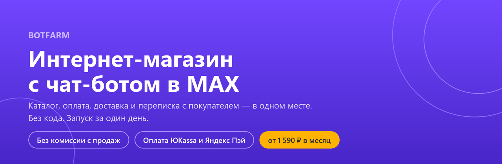
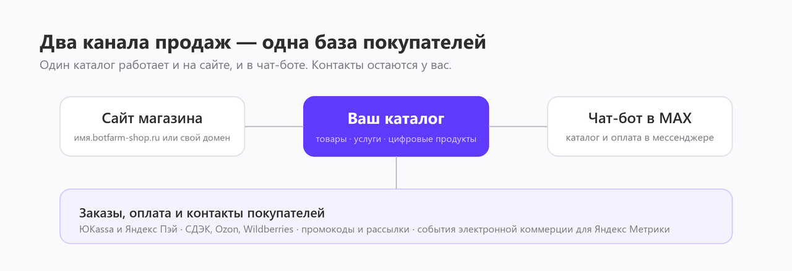

# 🛍️ Интернет-магазин BOTFARM с чат-ботом в MAX

**Русский** · [English](README.en.md)

🔗 Сайт продукта: **https://botfarm.online/shop/** · Обновлено: 1 сентября 2026

---

## 💡 Что такое интернет-магазин BOTFARM

**Интернет-магазин BOTFARM — это конструктор магазина, который работает одновременно как сайт и как чат-бот в российском мессенджере MAX.** Каталог, корзина, оплата и переписка с покупателем находятся в одном месте. Программист не нужен: магазин собирается за один день. Продавать можно физические товары, услуги и цифровые продукты. Сервис берёт фиксированную плату за магазин и не удерживает процент с продаж.

Разработчик — ООО «ФЛЕКСИБЕЙС» (ИНН 7733355085), продукт работает с 2020 года.

### 📌 Коротко о продукте

| Параметр | Значение |
| --- | --- |
| Что это | конструктор интернет-магазина с чат-ботом в MAX |
| Кому подходит | малый бизнес: розница, общепит, услуги, цифровые товары |
| Цена | 2 590 ₽ в месяц; 1 990 ₽ при оплате за 6 месяцев; 1 590 ₽ при оплате за 12 месяцев |
| Пробный период | 10 дней за 1 ₽, даётся один раз |
| Комиссия с продаж | нет |
| Приём оплаты | ЮKassa, Яндекс Пэй, наличные или перевод при получении |
| Доставка | самовывоз, курьер, ПВЗ СДЭК, Ozon, Wildberries |
| Аналитика | события электронной коммерции для Яндекс Метрики, микроразметка, товарные фиды (файлы выгрузки товаров) |
| Срок запуска | один день |
| Язык интерфейса | русский |
| Рынок | Россия |

---

## 🎯 Какую задачу решает

Небольшой продавец обычно выбирает между маркетплейсом и своим сайтом. Маркетплейс забирает процент с каждого заказа и не отдаёт контакты покупателя. Свой сайт нужно разработать, поддерживать, наполнить юридическими документами и как-то приводить на него людей.

- 💸 **Комиссия с оборота.** BOTFARM берёт фиксированную плату за магазин и не удерживает процент с продаж. Цена не растёт вместе с клиентской базой.
- 👤 **Чужая база покупателей.** Имя и номер телефона остаются у вас. По ним можно написать повторно — рассылкой или через чат-бота.
- 🚚 **Наценка на доставку.** Доставку вы оплачиваете напрямую перевозчику по его тарифам. BOTFARM не добавляет наценку и не берёт процент с заказа.
- ⚡ **Длинный путь к оплате.** Покупатель идёт от каталога до оплаты внутри мессенджера: без перехода на сторонний сайт, без регистрации и повторного ввода данных.
- 📄 **Сайт без обязательных документов.** В магазине есть типовые формы: пользовательское соглашение, политика обработки персональных данных, политика использования куки.
- 📣 **Один канал продаж.** Ссылку на бота можно поставить на визитки, баннеры, упаковку товара, в соцсети — контакты собираются в одну базу.

---

## 🆚 BOTFARM, маркетплейс или сайт на заказ

| | BOTFARM | Маркетплейс | Сайт на разработку |
| --- | --- | --- | --- |
| Комиссия с продаж | нет | есть, размер зависит от площадки и категории | нет |
| Контакты покупателя | остаются у продавца | остаются у площадки | остаются у продавца |
| Срок запуска | один день | дни на модерацию карточек | недели или месяцы |
| Стоимость старта | от 1 590 ₽ в месяц | без абонентской платы, но с процентом с заказов | разработка плюс размещение на сервере и поддержка |
| Нужен программист | нет | нет | да |
| Продажи в мессенджере | да, чат-бот в MAX | нет | отдельная разработка |
| Юридические формы | типовые формы в комплекте | документы площадки | пишутся отдельно |

Условия маркетплейсов и студий разработки отличаются от площадки к площадке — сравнивайте с конкретным предложением, которое рассматриваете.

---

## 👥 Кому подходит

- 🏬 продавцам маркетплейсов, которым нужен собственный канал продаж
- 🍜 кафе, ресторанам и доставке еды
- 👗 бутикам и небольшим розничным магазинам
- 💼 фрилансерам, консультантам, бизнес-тренерам
- 🎪 маркетинговым агентствам и организаторам мероприятий
- 🎨 мастерам и продавцам авторских товаров

---

## 🧩 Что внутри

**Витрина и заказы**

- каталог товаров, услуг и цифровых продуктов
- управление заказами и их статусами
- конструктор дизайна и разделов магазина
- типовые формы юридических документов

**Оплата и доставка**

- ЮKassa и Яндекс Пэй; наличные или перевод при получении включаются в настройках
- самовывоз, курьер, пункты выдачи СДЭК, Ozon и Wildberries
- цифровой товар уходит покупателю сразу после подтверждения оплаты: ссылкой на почту или в чат-бот

**Маркетинг и аналитика**

- события электронной коммерции для Яндекс Метрики, микроразметка, товарные фиды (файлы выгрузки товаров)
- промокоды и рассылки
- партнёрская программа
- чат-бот в MAX как точка входа с любых носителей

В тариф входят магазин, чат-бот, 1 ГБ базы данных и 1 ГБ под фото и файлы, а ещё адрес третьего уровня вида `имя.botfarm-shop.ru`.

---

## 🚀 Как открыть магазин: три шага

1. **Откройте магазин.** Выберите тариф и заполните данные: реквизиты, типовые формы документов, оформление страницы.
2. **Добавьте товары или услуги.** Загрузите фото, описания и цены.
3. **Принимайте заказы.** Поделитесь ссылкой — покупатели смотрят каталог, заказывают и оплачивают.

---

## 💰 Сколько стоит магазин в BOTFARM

Цены действуют на 1 сентября 2026 года, актуальные — на [странице тарифов](https://botfarm.online/price/).

| Тариф | Цена | Списание |
| --- | --- | --- |
| Пробный период | 1 ₽ за 10 дней | на 11-й день с той же карты спишется 2 589 ₽ и подписка продлится на 30 дней |
| 1 месяц | 2 590 ₽ / месяц | 2 590 ₽ |
| 6 месяцев | 1 990 ₽ / месяц | 11 940 ₽ за 6 месяцев |
| 12 месяцев | 1 590 ₽ / месяц | 19 080 ₽ за 12 месяцев |

Пробный период даётся один раз. Отключить списание можно в личном кабинете до конца пробного периода. Полные условия — в разделе 5 [Публичной оферты](https://botfarm.online/legal/public-offer).

### 🧾 Дополнительные услуги

| Услуга | Цена |
| --- | --- |
| Настройка магазина совместно с вами | 6 990 ₽ |
| Подключение своего домена второго уровня | 1 250 ₽ |
| Расширение хранилища на 1 ГБ | 80 ₽ / месяц |
| Подключение Яндекс Метрики | 2 590 ₽ |
| Консультация длительностью до часа | 5 000 ₽ |
| Индивидуальные доработки | по техническому заданию |

Адрес третьего уровня входит в тариф и денег не стоит. 1 250 ₽ — это подключение вашего собственного домена: настройка доменных записей (DNS) и выпуск сертификата. Регистрацию и продление домена вы оплачиваете регистратору напрямую.

---

## ⚠️ О чём стоит знать заранее

- Комиссию за приём онлайн-платежей удерживает ЮKassa или Яндекс Пэй, её размер зависит от способа оплаты и вашего договора с сервисом. При оплате наличными или переводом при получении комиссии нет.
- Обязанность применять кассу по 54-ФЗ лежит на продавце. ЮKassa с подключённым формированием чеков закрывает это сама, для Яндекс Пэй кассу вы подключаете отдельно.
- Юридических и бухгалтерских услуг BOTFARM не оказывает. Формы документов в магазине типовые: их нужно заполнить своими данными и проверить под свой бизнес.
- Расширенное хранилище нельзя уменьшить обратно.
- Интеграции с внешними системами настраиваются через Альбато и оплачиваются по его тарифам.

---

## ❓ Частые вопросы

**Какая комиссия за приём интернет-платежей?**
BOTFARM комиссию с продаж не берёт. Комиссию за онлайн-платёж удерживает ЮKassa или Яндекс Пэй: размер зависит от способа оплаты (СБП, карта, Mir Pay, СБЕР, Т-Банк) и вашего договора с сервисом. При оплате наличными или переводом при получении комиссии нет вовсе.

**Нужна ли онлайн-касса?**
Обязанность применять контрольно-кассовую технику по 54-ФЗ лежит на продавце. При приёме оплат через ЮKassa с подключённым формированием чеков отдельная касса не нужна — чеки формирует и отправляет покупателю сама ЮKassa. Для Яндекс Пэй касса подключается отдельно.

**Чем Яндекс Пэй отличается от ЮKassa?**
Это два независимых способа приёма оплаты, можно включить оба. ЮKassa — платёжный агрегатор: договор вы заключаете с ней, она принимает платёж, формирует чек и перечисляет деньги на ваш расчётный счёт. Яндекс Пэй — способ оплаты с отдельным договором с Яндексом, онлайн-кассу в этом случае вы подключаете сами.

**Можно ли продавать услуги и цифровые продукты?**
Да. В каталог добавляются не только физические товары. Цифровой товар покупатель получает сразу после подтверждения оплаты — ссылкой на указанную почту или в чат-бот.

**Деньги придут на существующий расчётный счёт?**
Да. Деньги перечисляет ЮKassa на указанный вами счёт, сроки выплат определяются вашим договором с ней.

**Можно ли оплатить магазин со счёта юридического лица?**
Да, напишите в поддержку для уточнения деталей.

**Какие есть интеграции и сколько они стоят?**
Интеграции настраиваются через сервис Альбато — он связывает магазин с большинством распространённых систем. Стоимость определяется тарифами Альбато и оплачивается на его стороне.

**Что такое MAX?**
MAX — российский мессенджер. Магазин BOTFARM работает в нём как чат-бот: покупатель смотрит каталог, оформляет заказ и платит, не выходя из переписки.

---

## 💬 Поддержка

Будни с 9 до 18 по Москве, перерыв с 13 до 14. Срок первичного ответа — не больше 8 часов (п. 4.2 Соглашения об уровне обслуживания).

- Telegram: [@botfarm_support](https://t.me/botfarm_support)
- Почта: info@botfarm.online

## 🔗 Ссылки

- [Магазин и тарифы](https://botfarm.online/shop/)
- [Примеры магазинов](https://botfarm.online/shop/examples/)
- [Документация](https://botfarm.online/docs/)
- [Блог](https://botfarm.online/shop/blog/)
- [О продукте](https://botfarm.online/shop/about/)
- [Правила использования](https://botfarm.online/legal/rules)

В этом репозитории лежит описание продукта. Исходный код магазина закрыт.

---

ООО «ФЛЕКСИБЕЙС», ИНН 7733355085, ОГРН 1207700172789. Разработка компьютерного программного обеспечения. © 2020–2026
